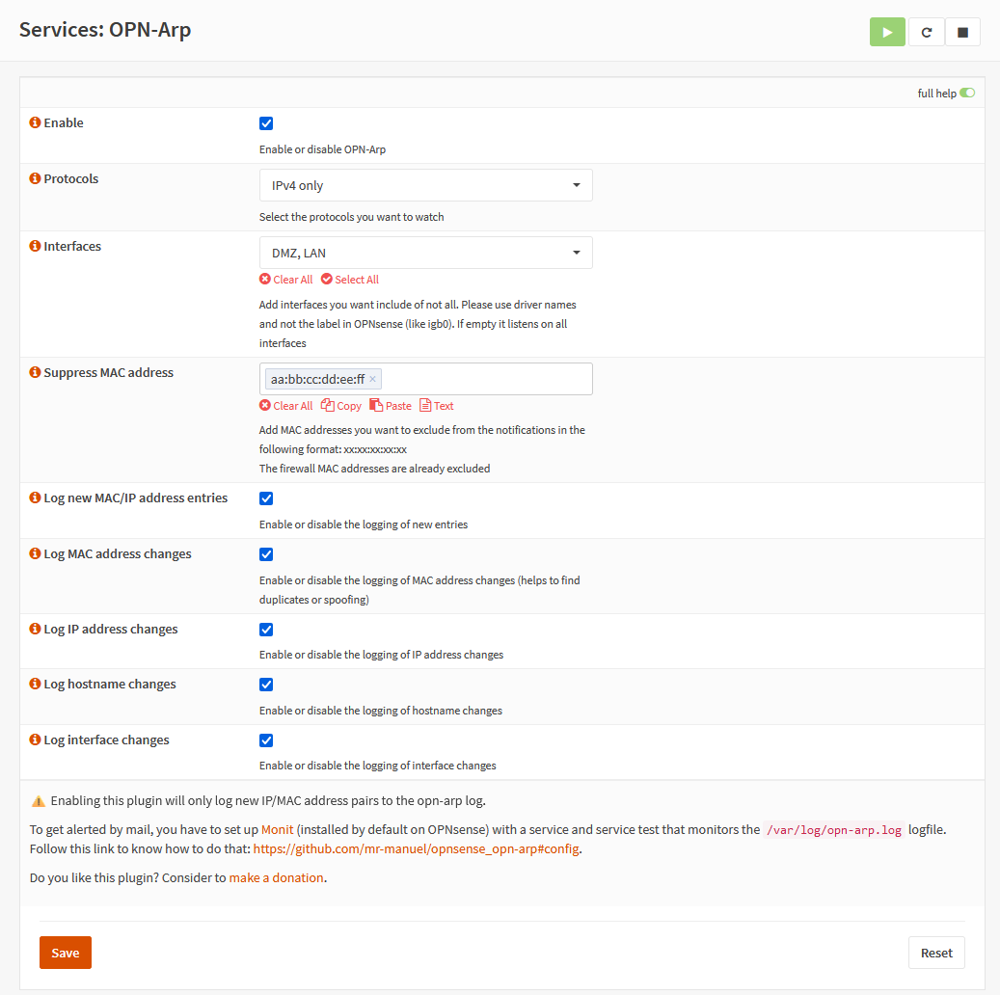
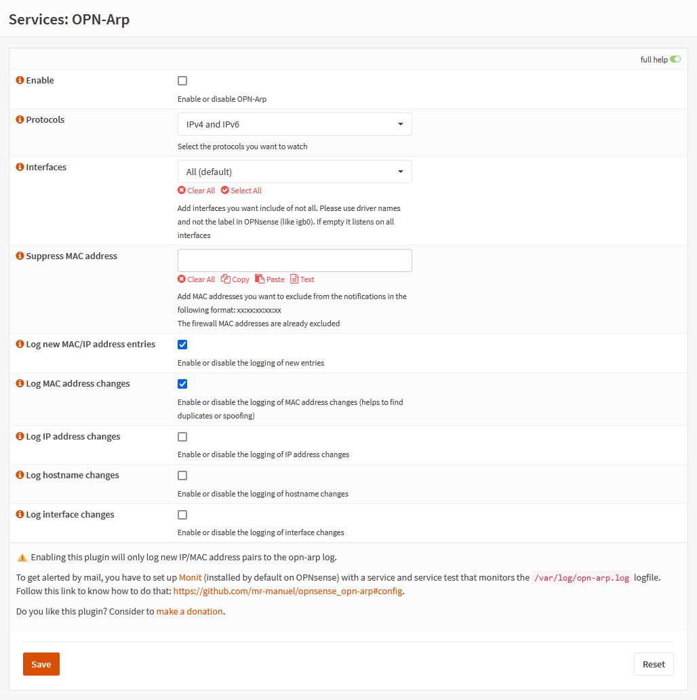

# OPN-Arp - arpwatch for OPNsense

<small>GitHub repository: [mr-manuel/opnsense_opn-arp](https://github.com/mr-manuel/opnsense_opn-arp)</small>


## Disclaimer

I wrote this script for myself. I'm not responsible, if you damage something using my script.


## Supporting/Sponsoring this project

You like the project and you want to support me?

[](https://www.paypal.com/donate/?hosted_button_id=3NEVZBDM5KABW)


## Purpose

This script was written to have a similar solution to the arpwatch of pfSense.

## Install

Will be added shortly after the tests ended. ETA ~2024.11.03.

## Config

1. Go to `Services` -> `Monit` -> `Settings` and then to the `General Settings` tab. Make sure you enabled Monit and populated the mail fields.

2. Go to the `Alert Settings` tab. Make sure, you added an alert. If not add a new alert, fill out the fields and then save:
   - Enable alert: ☑
   - Recipient: Insert the mail address where you want to receive the notifications
   - Not on: ☐
   - Events: `Nothing selected` or at least `Content failed`
   - Mail format:

      Copy the code below. Do not forget to replace `sender_mail_address@example.tld` with the mail from the account you set under `General Settings` -> `Mail Server Username`.
      ```
      from: sender_mail_address@example.tld
      subject: Monit alert -- $EVENT: $SERVICE
      message:
      $EVENT: $SERVICE

      # Host
      $HOST

      # Date
      $DATE

      # Action
      $ACTION

      # Description
      $DESCRIPTION
      ```
   - Reminder: leave empty
   - Description: Not needed, but you can insert whatever you like

3. Go to the `Service Tests Settings` tab. Add a new test, fill out the fields and then save:
   - Name: `OPN-ARP_common` or whatever you like
   - Condition: `content = "detected"`
   - Action: `Alert`

4. Go to the `Service Settings` tab. Add a new service, fill out the fields and then save:
   - Enable service checks: ☑
   - Name: `OPN-ARP_common` or whatever you like
   - Type: `File`
   - Path: `/var/log/opn-arp.log`
   - Start: leave empty
   - Stop: leave empty
   - Tests: Select `OPN-ARP_common` or whatever you inserted in step 2
   - Depends: leave empty
   - Description: Not needed, but you can insert whatever you like

### Possible conditions

| Description                                   | Condition                   |
| ---                                           | ---                         |
| Triggered on every log entry                  | `content = "detected"`      |
| Triggered when a new MAC/IP address is logged | `content = "New entry"`     |
| Triggered when a MAC address change is logged | `content = "OLD MAC"`       |
| Triggered when a IP address change is logged  | `content = "OLD IP"`        |
| Triggered when a hostname change is logged    | `content = "OLD Hostname"`  |
| Triggered when a interface change is logged   | `content = "OLD Interface"` |

## Screenshots




